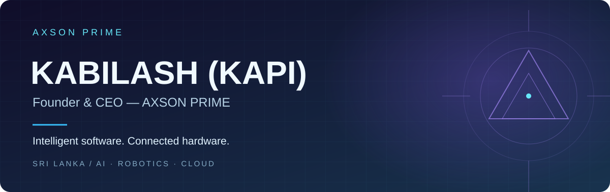
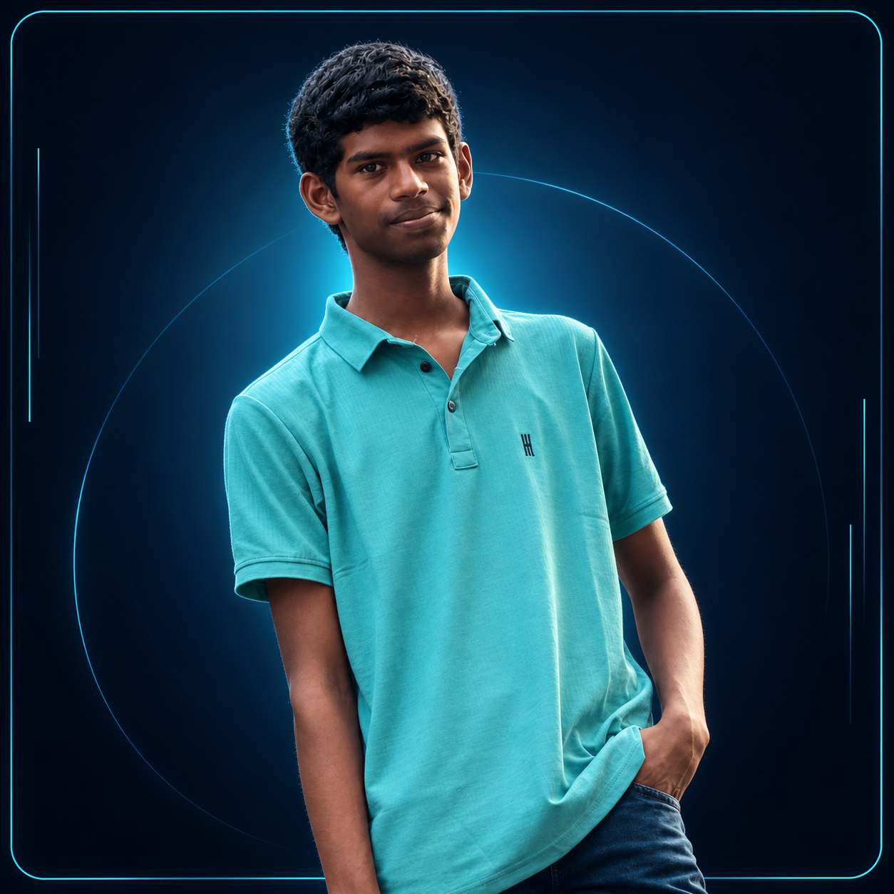
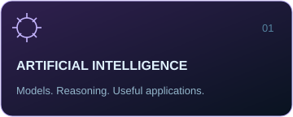
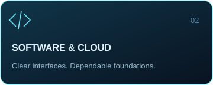
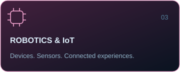
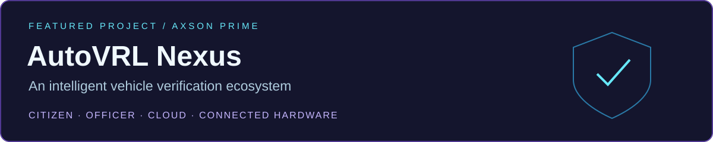
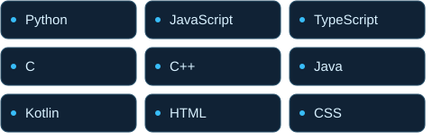
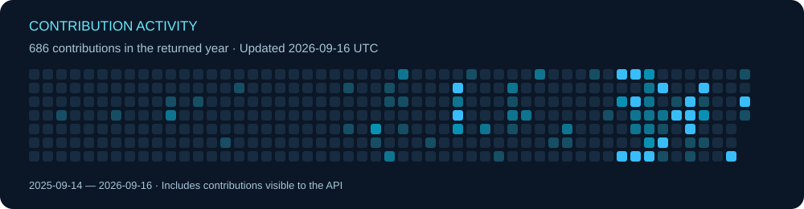

  

<h1 align="center">Kabilash (Kapi)</h1>

<strong>Founder &amp; CEO — AXSON PRIME</strong>

  
  

   
  <strong>AI Developer | Robotics Builder | Software Developer | Researcher | Problem Solver</strong>

  <strong>Based in Sri Lanka</strong> 
  

  <a href="#autovrl-nexus">Featured project</a> ·
  <a href="#technology-toolkit">Toolkit</a> ·
  <a href="#github-activity">Activity</a> ·
  <a href="#connect">Connect</a>

## Ideas into intelligent systems

I'm **Kabilash**, also known as **Kapi**, a developer and researcher from **Sri Lanka** and the Founder & CEO of **AXSON PRIME**. My focus spans artificial intelligence, software engineering, robotics, IoT, cloud systems and intelligent systems.

I'm interested in how these disciplines come together: software that helps people make decisions, hardware that connects to its environment, and systems that remain useful beyond ideal network conditions.

### About me

- **Main project:** AutoVRL Nexus, an intelligent vehicle-related digital verification ecosystem.
- **Engineering interests:** AI applications, connected devices and cloud-backed software.
- **Research direction:** intelligent systems that connect practical problems with thoughtful engineering.
- **Approach:** understand the problem, prototype the idea, test assumptions and refine the result.

## AXSON PRIME

**A home for my work across AI, software and connected hardware.**

As Founder & CEO, my direction for AXSON PRIME is to bring research and engineering together around useful intelligent systems. The focus is on clear user experiences, dependable foundations and purposeful connections between applications, devices and cloud services.

  
  
  

## AutoVRL Nexus

**My primary project focus:** an intelligent vehicle-related digital verification ecosystem designed around citizen applications, officer verification and connected hardware.

The intended scope brings together the following capabilities; this overview describes the project direction, rather than a claim that every feature is complete or deployed.

| Area | Intended capability |
| :--- | :--- |
| **Citizen application** | A digital interface for citizen-facing vehicle verification workflows. |
| **Officer verification** | Officer-facing checks supported by QR verification and authentication. |
| **Cloud backend** | Shared services for authentication, verification data and notifications. |
| **Offline operation** | Support for verification workflows with limited connectivity and offline-to-online synchronization. |
| **Accountability** | Audit logging to make verification events traceable. |
| **Device trust & hardware** | Trusted-device interactions and connected hardware integration. |

**Design questions:** How should offline records reconcile? What should a verification event capture? How can device trust support a clear, usable verification process?

## Technology toolkit

Technologies across my areas of work and exploration. This is a toolkit overview, not a proficiency ranking.

### Programming languages

### Application, cloud & backend technologies

### Robotics & IoT

**Exploration areas:** ESP32-S3 and Arduino prototyping, NFC/RFID interactions, connected hardware and the relationship between embedded devices and cloud services.

### Development tools

## Current work & research interests

- **AutoVRL Nexus:** shaping citizen and officer verification workflows, offline operation and connected-device interactions.
- **AI / ML / LLMs:** exploring intelligent applications, model evaluation and practical uses of language models.
- **Robotics & intelligent systems:** investigating how sensing, software and decision-making can work together.
- **Cloud & distributed systems:** studying synchronization, authentication, auditability and dependable backend design.

### Development workflow

> **Understand → Design → Prototype → Validate → Refine**

1. Define the user problem, constraints and expected behavior.
2. Map application flows, data boundaries and device interactions.
3. Build focused prototypes with version control and clear documentation.
4. Test core behavior, failure cases and offline scenarios where relevant.
5. Review what works, simplify what does not and iterate.

### Goals

- Advance AutoVRL Nexus through focused, testable engineering milestones.
- Deepen research and practical skills in AI, robotics and intelligent systems.
- Build clearer bridges between hardware, applications and cloud infrastructure.
- Share useful work and documentation through AXSON PRIME and GitHub.

## GitHub activity

<!-- Live cards use the actual account. Third-party services may cache data or become unavailable. -->

  
  

  

  

Statistics and language cards use third-party services. The dated streak and activity cards use GitHub API data and refresh daily through GitHub Actions once enabled. Language distribution reflects repository composition, not skill level. The view counter records badge loads, not unique visitors.

[View repositories](https://github.com/kapilashkapilash2025-netizen?tab=repositories) · [View contributions on GitHub](https://github.com/kapilashkapilash2025-netizen?tab=overview)

## Connect

Interested in AI, robotics, software engineering or connected systems? Explore my work on GitHub or get in touch by email.

  <a href="https://github.com/kapilashkapilash2025-netizen"><strong>Explore my GitHub</strong></a> &nbsp; · &nbsp;
  <a href="mailto:kapilashkapilash2025@gmail.com"><strong>Let’s connect by email</strong></a>

